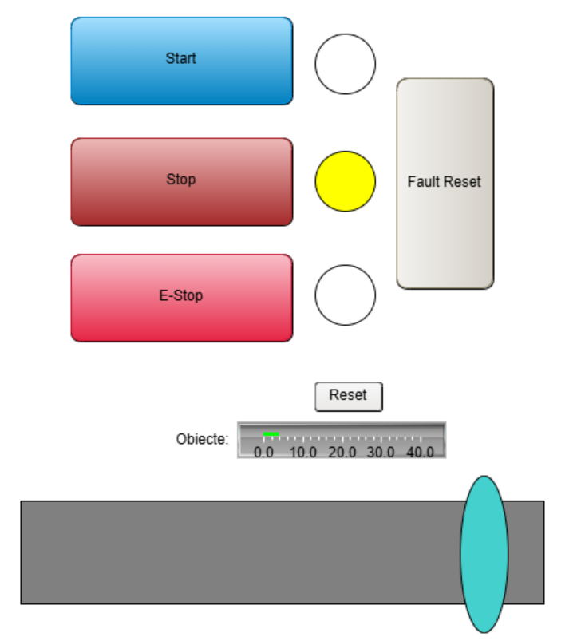
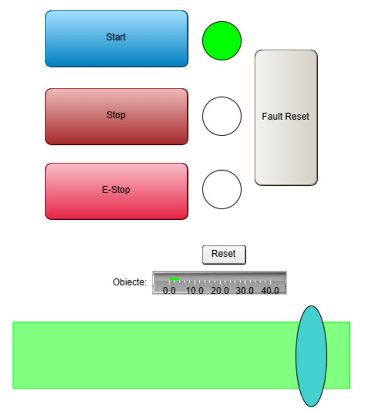
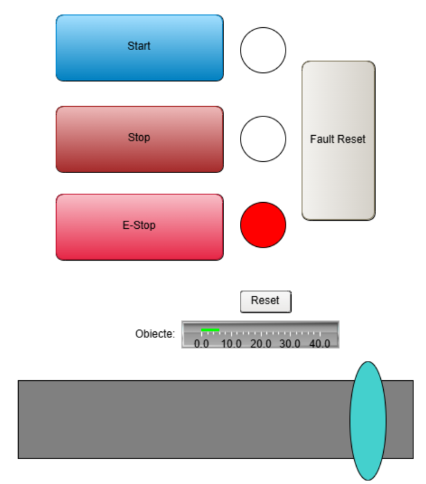

# 🏭 Conveyor Belt Control System — CODESYS

A PLC-based conveyor belt control system developed in CODESYS using Structured Text (ST) following the IEC 61131-3 standard. This project simulates an industrial conveyor belt with object counting, fault management, and an HMI operator panel.

---

## 📋 Features

- **Start / Stop** control of the conveyor belt motor
- **Emergency Stop (E-Stop)** with manual Fault Reset — belt cannot restart until operator confirms reset
- **Automatic object detection** simulated via a periodic sensor trigger (R_TRIG)
- **Object counter** with visual Bar Display and manual Counter Reset
- **3-state signaling system** — Green (Running), Yellow (Standby), Red (Fault)
- **HMI Visualization** built in CODESYS Visualization with real-time feedback

---

## 🛠️ Technologies

- **CODESYS** (2026) — Development environment
- **Structured Text (ST)** — IEC 61131-3 programming language
- **SoftPLC** — CODESYS Control Win V3 (software simulation, no physical hardware required)
- **CODESYS Visualization** — HMI operator panel

---

## 📁 Project Structure

```
ConveyorBelt/
├── GVL.gvl          # Global Variable List — all I/O and internal variables
├── PLC_PRG.st       # Main control logic
└── Visualization    # HMI operator panel
```

---

## ⚙️ System Logic

### Control States

| State | Belt | Green Light | Yellow Light | Red Light |
|-------|------|-------------|--------------|-----------|
| Standby | OFF | ❌ | ✅ | ❌ |
| Running | ON | ✅ | ❌ | ❌ |
| Fault (E-Stop) | OFF | ❌ | ❌ | ✅ |

### E-Stop Sequence
1. Operator presses **E-Stop** → belt stops immediately, fault active
2. Operator presses **Fault Reset** → fault cleared, system in Standby
3. Operator presses **Start** → belt resumes

> ⚠️ The belt does **not** restart automatically after Reset — by design, for operator safety.

---

## 🔧 Global Variables (GVL)

| Variable | Type | Description |
|----------|------|-------------|
| `btn_Start` | BOOL | Start button |
| `btn_Stop` | BOOL | Stop button |
| `btn_EStop` | BOOL | Emergency stop button |
| `btn_FaultReset` | BOOL | Resets E-Stop fault |
| `btn_CounterReset` | BOOL | Resets object counter |
| `sensor_Object` | BOOL | Object detected on belt |
| `motor_Run` | BOOL | Belt motor output |
| `belt_Running` | BOOL | Internal belt state |
| `fault_Active` | BOOL | Fault flag |
| `object_Count` | INT | Number of objects counted |
| `light_Green` | BOOL | Running indicator |
| `light_Red` | BOOL | Fault indicator |
| `light_Yellow` | BOOL | Standby indicator |

---

## 🖥️ HMI Panel

The operator panel includes:
- **Start / Stop / E-Stop / Fault Reset / Counter Reset** buttons
- **3 signal lights** (Green / Red / Yellow)
- **Conveyor belt** visualization (grey = stopped, green = running)
- **Object counter** with Bar Display

---

## 📌 Key Concepts Used

- **R_TRIG** (Rising Trigger) — detects the exact moment an object passes the sensor, preventing multiple counts per object
- **TON** (Timer On Delay) — used for periodic sensor simulation
- **GVL** (Global Variable List) — separates I/O signals from internal logic
- **Separation of concerns** — `belt_Running` (internal logic) vs `motor_Run` (output signal)
- **IEC 61131-3** — international standard for PLC programming

---

## 🖥️ Demo

▶️ [Watch Demo on YouTube](https://youtu.be/oPn-tsukg_s)

### HMI Screenshots

| Standby | Running | Fault |
|---------|---------|-------|
|  |  |  |

---

## 🚀 How to Run

1. Install **CODESYS Development System** from [codesys.com](https://www.codesys.com)
2. Open the project file in CODESYS
3. Start the **SoftPLC** (CODESYS Control Win V3 icon in system tray → Start PLC)
4. Press **F11** to Build
5. **Online → Login** → Download to device → **Yes**
6. Press **F5** to Start
7. Open **Visualization** and interact with the HMI

---

## 👤 Author

**Turcu Alexandru Costin** • [LinkedIn](https://www.linkedin.com/in/alexandru-costin-turcu-4a95311a6/)